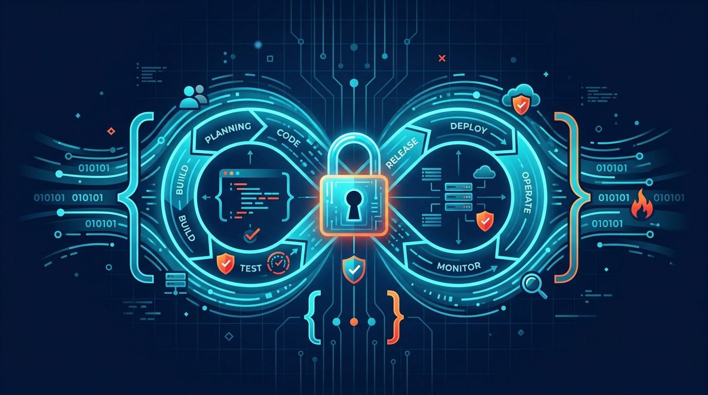

# DevSecOps Interview Questions & Security Guide

As the cloud industry shifts heavily towards 'Shift-Left' security, the demand for DevSecOps engineers has skyrocketed. Technical interviews for these roles go far beyond basic CI/CD knowledge; they dive deep into container security, infrastructure as code (IaC) scanning, zero-trust architecture, and secrets management.\n\nWhether you are preparing for a senior role at a tech giant or looking to transition from traditional sysadmin to DevSecOps, mastering these concepts is critical.\n\nOur comprehensive DevSecOps Interview Guide outlines the most critical scenario-based questions, tools (SonarQube, Trivy, HashiCorp Vault), and security architectures you must know to crack elite engineering interviews.

**[Read the full technical breakdown here](https://techupdate24.com/devsecops-interview-questions/)**

---
*Maintained by Kiran Sonawane | Senior Cloud & DevOps Engineer*
